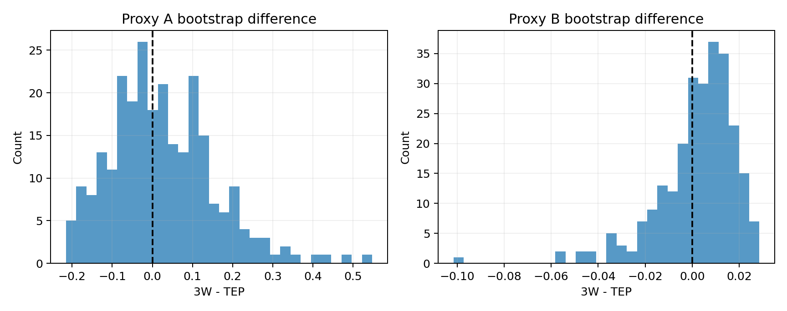

# Budget Demand Proxy Audit

所有输入与 normalization 均来自 frozen train split；未加载正式 validation/test 数据或指标。

| Proxy | 3W | TEP | 3W-TEP | Bootstrap direction | LOO direction | PASS |
|---|---:|---:|---:|---:|---:|---|
| A Cross-Group Shift | 0.394864 | 0.390645 | +0.004219 | 0.539 | 0.974 | False |
| B Separability Difficulty | 0.976831 | 0.967837 | +0.008993 | 0.641 | 1.000 | False |

Stage A：`NO_GO_BUDGET_DEMAND_CONTROLLER`。

预注册稳定性门槛：bootstrap direction `>= 0.80`，LOO direction `>= 0.80`。两个代理的点估计方向正确且 LOO 不由单一 group 驱动，但 bootstrap 方向均不够稳定。

## Proxy A stage-wise

| Dataset | Stage | Score | Between | Within | Groups |
|---|---|---:|---:|---:|---:|
| 3W | normal | 0.805666 | 0.213546 | 0.265056 | 20 |
| 3W | early | 0.175545 | 0.338074 | 1.925847 | 11 |
| 3W | mature | 0.364047 | 4.556211 | 12.515446 | 10 |
| TEP | normal | 0.089800 | 0.054832 | 0.610598 | 128 |
| TEP | early | 1.499497 | 0.684451 | 0.456454 | 120 |
| TEP | mature | 0.597456 | 0.492294 | 0.823984 | 120 |

## Proxy B separability views

| Dataset | View | Difficulty | Separability | Samples |
|---|---|---:|---:|---:|
| 3W | Normal vs Fault | 0.976831 | 0.023718 | 12155 |
| 3W | Normal vs Early | 0.974569 | 0.026095 | 11384 |
| TEP | Normal vs Fault | 0.967837 | 0.033231 | 6704 |
| TEP | Normal vs Early | 0.910867 | 0.097855 | 4064 |

