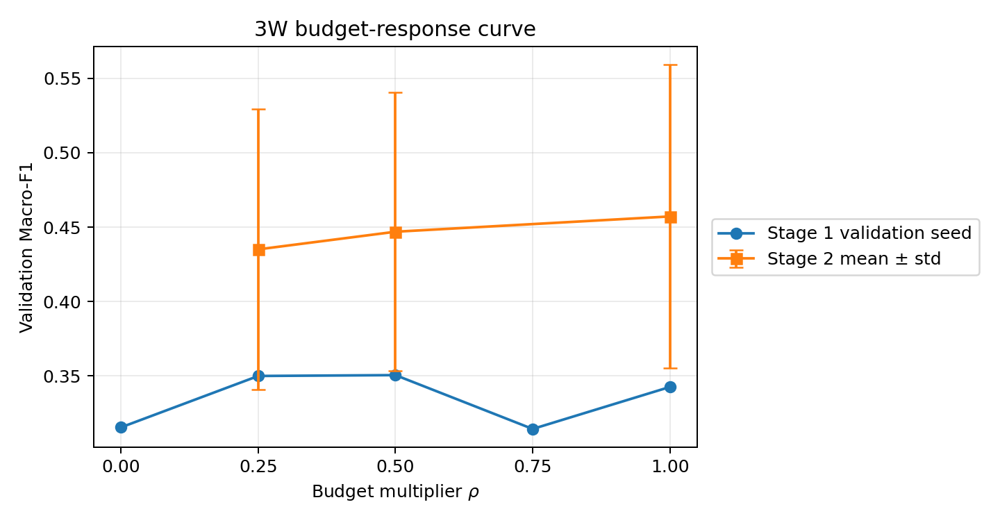
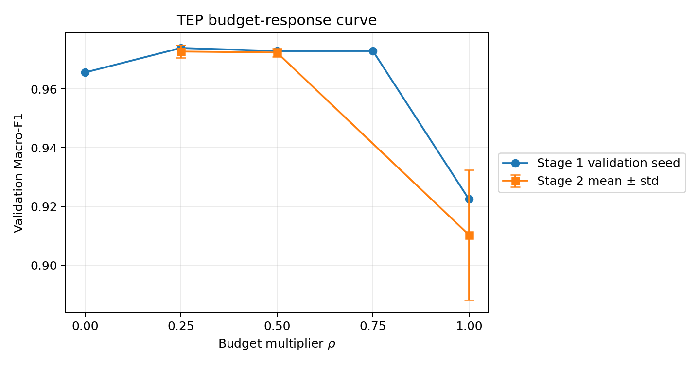

# Budget Shrinkage Diagnostic

所有结果均为 validation-only；未读取 test 指标。FINAL 的 D/E、critical ratio、Channel×Frequency soft mask、TCN、Hard SupCon、Original batching、Probe 和 threshold procedure 均未改变。

## Stage 1：五点单 seed 曲线

### 3W seed 42

| rho | Macro-F1 | AUPRC | FAR | Early Recall | Delay | Effective Budget |
|---:|---:|---:|---:|---:|---:|---:|
| 0.00 | 0.3154 ± 0.0000 | 0.5967 ± 0.0000 | 0.4321 ± 0.0000 | 0.8593 ± 0.0000 | 1899.2500 ± 0.0000 | 0.00000000 |
| 0.25 | 0.3500 ± 0.0000 | 0.6470 ± 0.0000 | 0.3475 ± 0.0000 | 0.8390 ± 0.0000 | 1716.2222 ± 0.0000 | 0.00449341 |
| 0.50 | 0.3505 ± 0.0000 | 0.6157 ± 0.0000 | 0.3426 ± 0.0000 | 0.8237 ± 0.0000 | 1947.2500 ± 0.0000 | 0.00898682 |
| 0.75 | 0.3144 ± 0.0000 | 0.6160 ± 0.0000 | 0.4373 ± 0.0000 | 0.8731 ± 0.0000 | 1670.0000 ± 0.0000 | 0.01348023 |
| 1.00 | 0.3426 ± 0.0000 | 0.6288 ± 0.0000 | 0.3426 ± 0.0000 | 0.8536 ± 0.0000 | 1955.2500 ± 0.0000 | 0.01797364 |

### TEP seed 7

| rho | Macro-F1 | AUPRC | FAR | Early Recall | Delay | Effective Budget |
|---:|---:|---:|---:|---:|---:|---:|
| 0.00 | 0.9656 ± 0.0000 | 0.9953 ± 0.0000 | 0.0558 ± 0.0000 | 0.9750 ± 0.0000 | 110.6000 ± 0.0000 | 0.00000000 |
| 0.25 | 0.9740 ± 0.0000 | 0.9955 ± 0.0000 | 0.0446 ± 0.0000 | 0.9938 ± 0.0000 | 107.4000 ± 0.0000 | 0.00449341 |
| 0.50 | 0.9729 ± 0.0000 | 0.9954 ± 0.0000 | 0.0424 ± 0.0000 | 0.9938 ± 0.0000 | 107.4000 ± 0.0000 | 0.00898682 |
| 0.75 | 0.9729 ± 0.0000 | 0.9955 ± 0.0000 | 0.0413 ± 0.0000 | 0.9938 ± 0.0000 | 107.4000 ± 0.0000 | 0.01348023 |
| 1.00 | 0.9225 ± 0.0000 | 0.9819 ± 0.0000 | 0.0324 ± 0.0000 | 0.8313 ± 0.0000 | 138.6000 ± 0.0000 | 0.01797364 |

Stage 1 按预注册规则选择 `rho=[0.25, 0.5, 1.0]`：TEP validation 从低预算池选 `0.25`；跨数据集标准化 Macro-F1 从中间池选 `0.5`；`1.0` 为冻结 reference。

## Stage 2：三随机种子

### 3W seeds [42, 43, 44]

| rho | Macro-F1 | AUPRC | FAR | Early Recall | Delay | Effective Budget |
|---:|---:|---:|---:|---:|---:|---:|
| 0.25 | 0.4351 ± 0.0942 | 0.6278 ± 0.0313 | 0.3085 ± 0.0338 | 0.8258 ± 0.0701 | 1334.5926 ± 1052.3564 | 0.00449341 |
| 0.50 | 0.4469 ± 0.0935 | 0.6152 ± 0.0666 | 0.3068 ± 0.0309 | 0.8723 ± 0.0433 | 1432.9352 ± 1106.9030 | 0.00898682 |
| 1.00 | 0.4572 ± 0.1019 | 0.6689 ± 0.0350 | 0.3014 ± 0.0366 | 0.8987 ± 0.0514 | 1428.4907 ± 1104.8030 | 0.01797364 |

### TEP seeds [7, 42, 2026]

| rho | Macro-F1 | AUPRC | FAR | Early Recall | Delay | Effective Budget |
|---:|---:|---:|---:|---:|---:|---:|
| 0.25 | 0.9728 ± 0.0021 | 0.9955 ± 0.0003 | 0.0443 ± 0.0050 | 0.9958 ± 0.0036 | 108.0667 ± 1.5144 | 0.00449341 |
| 0.50 | 0.9724 ± 0.0014 | 0.9955 ± 0.0003 | 0.0439 ± 0.0046 | 0.9958 ± 0.0036 | 107.2667 ± 0.2309 | 0.00898682 |
| 1.00 | 0.9103 ± 0.0221 | 0.9770 ± 0.0110 | 0.0420 ± 0.0228 | 0.8458 ± 0.0977 | 131.2286 ± 6.4531 | 0.01797364 |

## 配对与 LOSO

- 3W `rho=1.0 - rho=0.25`：ΔMacro-F1 `+0.0221`，正向 `2/3`；ΔFAR `-0.0072`，ΔEarly Recall `+0.0729`。
- TEP `rho=0.25 - rho=1.0`：ΔMacro-F1 `+0.0624`，正向 `3/3`；ΔFAR `+0.0022`，ΔEarly Recall `+0.1500`。
- Leave-one-seed-out 最优 rho：3W `[1.0, 1.0, 0.5]`；TEP `[0.25, 0.25, 0.25]`。3W 始终落在中高预算区域，TEP 始终落在低/中预算区域，均未跨到对方极端区域。

## 审计

- mask 跨 rho/seed 固定：`True`；fairness hash 对齐：`True`。
- 最大总预算绝对误差：`0.000e+00`；最大相对 allocation error：`5.960e-08`。
- validation-only / test 未读取：`True`；rho=0 的 effective budget 精确为 0。

## 结论

`GO_BUDGET_CONSTRAINED_ALLOCATION_V2`。3W 随预算提升总体改善并偏好中高区域；TEP 对满预算出现稳定明显退化，而 0.25/0.50 均稳定恢复。证据支持“不同工业 domain 的安全扰动容量不同”，但不意味着人工为每个数据集固定 test-optimal rho。
