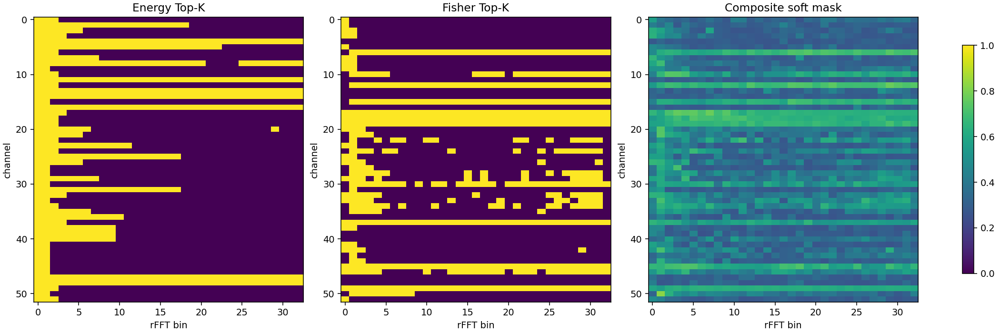
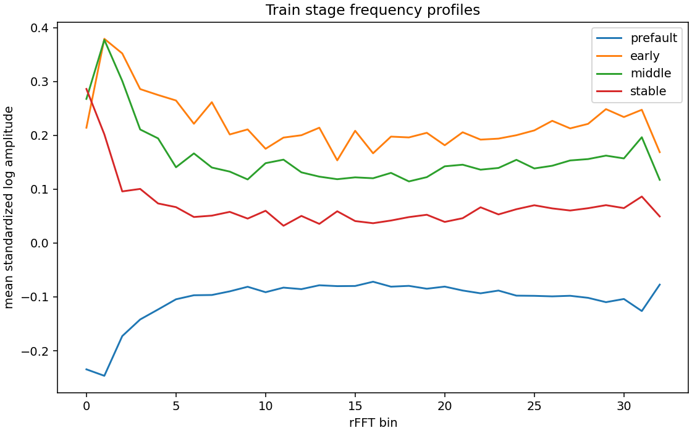
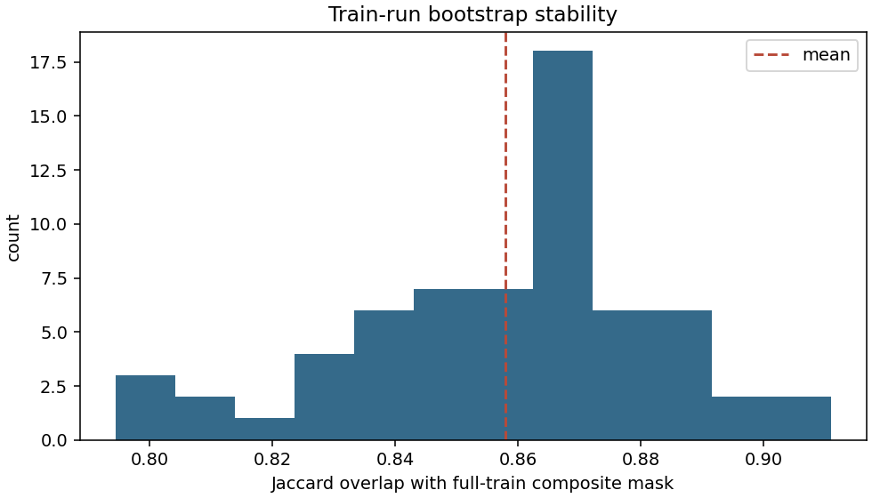

# 故障阶段与关键频率审计

> **STAGE_FREQUENCY_DIFFUSION_MVP / FORWARD_DIFFUSION_ONLY / FIXED_TEP_SUBSET / NOT_FOR_PAPER_CLAIMS**

## 结论

状态：`FREQUENCY_CRITICALITY_AUDIT_GO`。频率统计、标准化、D/E/S、三种 mask 与 bootstrap 均只由 train split 拟合；validation/test 仅用于外部方向验证和报告。

旧质量评价、候选排序和教师语义路线已连续得到 NO-GO，本主线不再训练反向恢复器或教师约束，而是检验工业故障是否存在跨 Run 可重复、早期敏感且可选择性保护的频带。

## 数据与阶段协议

| Split | 窗口数 | Run 数 |
|---|---:|---:|
| train | 6704 | 248 |
| validation | 1936 | 72 |
| test | 4440 | 80 |

| Split | prefault | early | middle | stable |
|---|---:|---:|---:|---:|
| train | 3584 | 480 | 960 | 1680 |
| validation | 896 | 160 | 320 | 560 |
| test | 2560 | 160 | 320 | 1400 |

training/testing 的真实 fault onset 分别为 21/161。保存原始 `delta=end_sample-onset`；为适配长度 64 的完整非过渡窗口，阶段进度定义为 `delta-(window_length-1)`。进度 `[0,4*stride)` 为 early、`[4*stride,12*stride)` 为 middle，其后为 stable。这样 training 与 testing 均严格覆盖 onset 后首 4 个完整故障窗口，不使用固定绝对 `start_sample`。

## 频率表示与关键性

`x_base [N,52,64]` 经 `torch.fft.rfft` 得到 33 个 bin，使用 `log1p(abs(X))` 并保留 phase。频谱 scaler 只在 train 拟合。

- D：先按 Run 聚合，再计算 normal/fault 类间—类内 Fisher 比。
- E：按 Run 聚合的 early fault 与 train normal Fisher 比。
- S：fault Run 相对 normal Run 中位参考的方向一致性，并以稳健变异系数惩罚。
- Composite：train-only median/IQR robust normalization 后按 `0.5D + 0.3E + 0.2S` 组合。

三种相同比例（30%）mask 的重合：energy/composite Jaccard=0.0911，fisher/composite Jaccard=0.8198。Composite bootstrap overlap 为 0.8579±0.0244。

## 每通道 Top-5 Composite 频率

| Channel（0-based） | rFFT bins |
|---:|---|
| 0 | 0, 10, 31, 11, 21 |
| 1 | 2, 16, 0, 21, 4 |
| 2 | 0, 7, 1, 2, 29 |
| 3 | 0, 1, 3, 2, 6 |
| 4 | 16, 1, 28, 26, 23 |
| 5 | 0, 1, 19, 22, 2 |
| 6 | 19, 29, 21, 17, 32 |
| 7 | 0, 1, 18, 2, 25 |
| 8 | 1, 0, 8, 2, 12 |
| 9 | 4, 1, 0, 28, 31 |
| 10 | 2, 3, 4, 1, 27 |
| 11 | 28, 20, 12, 26, 6 |
| 12 | 29, 22, 30, 17, 32 |
| 13 | 28, 14, 22, 29, 30 |
| 14 | 8, 31, 9, 28, 18 |
| 15 | 17, 18, 29, 19, 25 |
| 16 | 25, 28, 17, 16, 32 |
| 17 | 7, 3, 5, 4, 9 |
| 18 | 5, 9, 11, 6, 7 |
| 19 | 29, 12, 31, 10, 20 |
| 20 | 1, 2, 0, 8, 7 |
| 21 | 1, 2, 3, 22, 4 |
| 22 | 11, 22, 10, 7, 21 |
| 23 | 1, 0, 4, 2, 31 |
| 24 | 5, 6, 1, 26, 3 |
| 25 | 1, 0, 4, 8, 2 |
| 26 | 0, 1, 4, 2, 14 |
| 27 | 3, 1, 2, 31, 28 |
| 28 | 4, 1, 5, 28, 17 |
| 29 | 4, 1, 28, 0, 29 |
| 30 | 7, 25, 9, 6, 14 |
| 31 | 1, 0, 30, 21, 11 |
| 32 | 0, 1, 2, 31, 29 |
| 33 | 1, 26, 31, 30, 2 |
| 34 | 1, 21, 7, 3, 26 |
| 35 | 1, 3, 11, 4, 2 |
| 36 | 9, 14, 1, 4, 13 |
| 37 | 0, 19, 2, 12, 3 |
| 38 | 1, 0, 22, 12, 4 |
| 39 | 0, 8, 5, 1, 18 |
| 40 | 2, 10, 7, 26, 12 |
| 41 | 0, 2, 1, 5, 8 |
| 42 | 1, 29, 2, 0, 9 |
| 43 | 22, 11, 21, 19, 28 |
| 44 | 1, 6, 9, 2, 3 |
| 45 | 18, 4, 5, 3, 16 |
| 46 | 4, 1, 16, 15, 31 |
| 47 | 28, 0, 12, 11, 8 |
| 48 | 0, 18, 5, 8, 17 |
| 49 | 6, 3, 13, 9, 7 |
| 50 | 1, 2, 5, 3, 12 |
| 51 | 0, 1, 28, 27, 8 |

## Fault 3/9/15 重点频率

| Split | Fault | 窗口数 | Top channel/bin |
|---|---:|---:|---|
| train | 3 | 156 | c20/f0, c0/f10, c22/f10, c43/f10, c22/f22 |
| train | 9 | 156 | c22/f10, c43/f22, c0/f10, c33/f13, c43/f10 |
| train | 15 | 156 | c21/f18, c0/f10, c21/f9, c23/f14, c21/f16 |
| validation | 3 | 52 | c20/f0, c21/f25, c9/f8, c51/f18, c14/f14 |
| validation | 9 | 52 | c16/f32, c24/f24, c44/f19, c9/f4, c31/f24 |
| validation | 15 | 52 | c40/f2, c36/f3, c5/f18, c41/f5, c34/f0 |
| test | 3 | 108 | c20/f0, c39/f22, c51/f11, c26/f13, c24/f19 |
| test | 9 | 108 | c27/f19, c39/f29, c5/f28, c39/f22, c26/f8 |
| test | 15 | 108 | c48/f16, c5/f28, c27/f20, c51/f19, c41/f32 |

这些 validation/test 结果只验证 train 拟合方向，没有反向修改 mask。

## Gate

- 关键/非关键 Fisher 均值比：5.6209
- 关键频带 E / 随机同规模频带 E：2.2524
- validation 关键频率方向一致率：1.0000
- 选中频率中 bin>2 的比例：0.8369

- 通过：`train_run_bootstrap_reproducible`
- 通过：`critical_fisher_above_noncritical`
- 通过：`critical_early_above_random`
- 通过：`energy_not_equivalent_to_composite`
- 通过：`validation_direction_preserved`
- 通过：`mask_not_only_dc_or_lowest_bins`

通过条件采用 6 项中的至少 4 项。若状态为 `FREQUENCY_CRITICALITY_AUDIT_NO_GO`，则停止 C0/C1/C2；若为 `FREQUENCY_CRITICALITY_AUDIT_GO`，才允许进入前向频谱扩散 MVP。

> 本报告仅为小型固定 TEP 子集工程审计：**NOT_FOR_PAPER_CLAIMS**。
