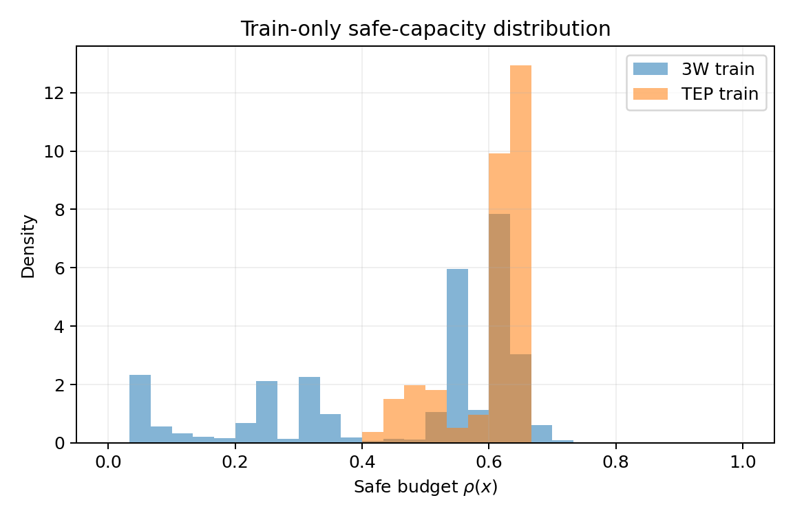

# Safe Capacity Train-only Audit

定义：`critical_energy_ratio(x)=sum(C_cf*P_cf(x))/sum(P_cf(x))`，`rho(x)=(1-critical_energy_ratio(x))^1.0`；冻结 `gamma=1.0`。

| Dataset | Windows | Mean rho | Std | Median | P05 | P95 |
|---|---:|---:|---:|---:|---:|---:|
| 3W | 12155 | 0.470266 | 0.194201 | 0.543521 | 0.047385 | 0.655841 |
| TEP | 6704 | 0.602268 | 0.061700 | 0.629787 | 0.459957 | 0.650371 |

3W - TEP mean rho：`-0.132002`。Stage A 判定：`NO_GO_SAFE_CAPACITY_DIRECTION`。

## Gamma 候选方向检查

| Gamma | 3W mean rho | TEP mean rho | 3W - TEP |
|---:|---:|---:|---:|
| 0.5 | 0.662541 | 0.774947 | -0.112406 |
| 1.0 | 0.470266 | 0.602268 | -0.132002 |
| 2.0 | 0.258864 | 0.366534 | -0.107670 |

三个允许候选均保持相反方向；gamma 是单调变换，不能修复跨数据集排序。

## 阶段分布

| Dataset | Stage | Windows | Mean rho | Std | Median |
|---|---|---:|---:|---:|---:|
| 3W | early | 7384 | 0.394056 | 0.196449 | 0.441675 |
| 3W | mature | 771 | 0.455165 | 0.189469 | 0.566713 |
| 3W | normal | 4000 | 0.613860 | 0.071120 | 0.624200 |
| TEP | early | 480 | 0.564712 | 0.074384 | 0.593671 |
| TEP | mature | 2640 | 0.565659 | 0.074179 | 0.598310 |
| TEP | normal | 3584 | 0.634265 | 0.011261 | 0.635945 |

所有统计仅来自 frozen train split；未加载 validation/test 选择或拟合 capacity。
完整 class、WELL、Run/fault-type 分组统计见 `safe_capacity_audit.csv`。
